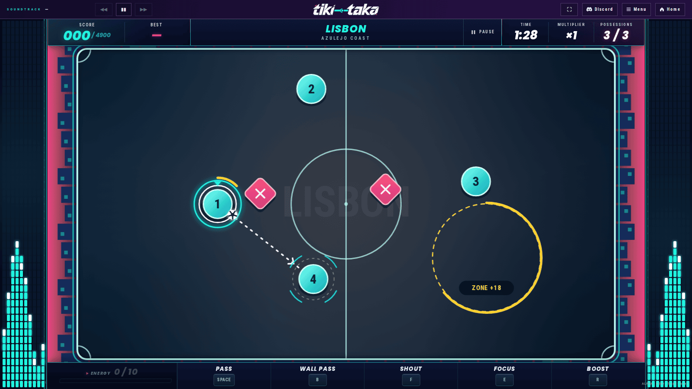
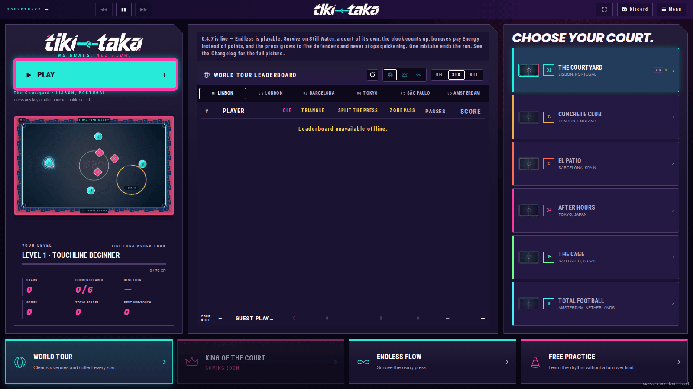
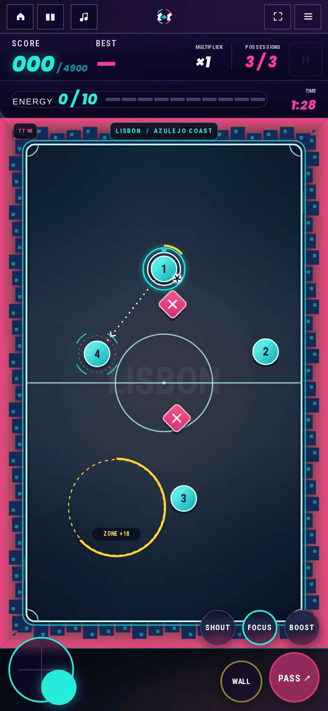
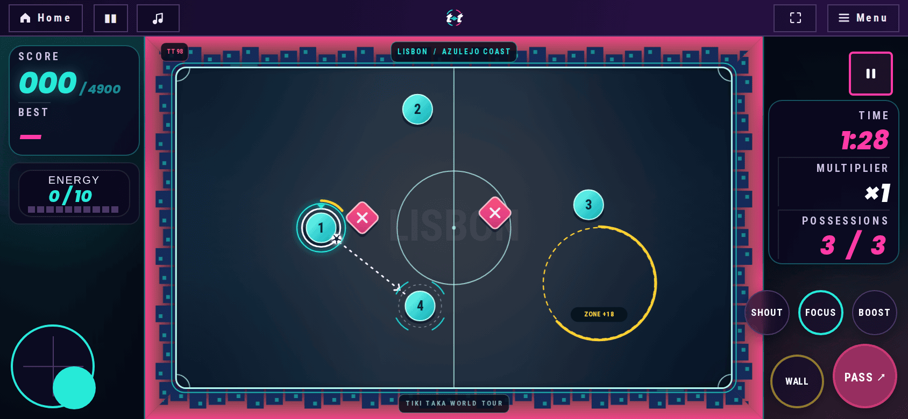

# Tiki Taka

[](https://github.com/christopherjnelson/tiki-taka/actions/workflows/ci.yml)
[](https://github.com/christopherjnelson/tiki-taka/actions/workflows/release.yml)
[](LICENSE.md)
[](package.json)
[](https://nodejs.org/)
[](https://tiki-taka.chris.guru/)

A single-player arcade soccer possession game in an enclosed court. There are no shots or goals: move into space, connect passes, and make the next touch count.

Tiki Taka is a browser game built with vanilla JavaScript, Canvas 2D, and Web Audio. It runs guest-first without a required backend, with optional Supabase accounts.



## Quick start

Use Node.js 22.12 or newer (Node 24 recommended):

```sh
npm ci
npm start
```

Open the game at <http://localhost:5173>.

## Ways to play

Play in a desktop browser with keyboard, mouse, or a standard gamepad. The game is also playable on a phone in both orientations — the arena renders a rotated court in portrait. The production build precaches its app shell after the first online load and is installable where the browser supports it; service workers require localhost or HTTPS. The soundtrack is not part of that precache or the build itself: tracks are fetched from a runtime manifest alongside the served app and cached after first use, so new music can ship without a new release.

| Desktop | Phone portrait | Phone landscape |
|---------|---------------|-----------------|
|  |  |  |

## Game overview

Control the ball carrier while three teammates find supporting positions. Pass before the press closes in. An interception or tackle costs a possession and resets the formation; the number of possessions depends on the difficulty tier (five on Relaxed, three on Standard, one on Ruthless).

Build a score multiplier by chaining bonuses (zones build it fastest; olés, triangles and splits build it too, wall passes don't) before it slips a step after 6 seconds idle, and queue passes for one-touch combinations. Triangles, bonus-zone receptions, press splits, and Olé milestones earn Energy, the shared reserve behind Focus (slowing the court) and Boost. Home offers four modes:

- **World tour** — six fixed venues, three difficulty tiers, stars and progression.
- **King of the Court** — its own court (The Rooftop) cut into a grid of 24 squares, and a 90-second round. Passes take the square the receiver stands in and bonuses take whole shapes of squares; a turnover costs the ground around it but never the round, and holding all 24 crowns you and clears the board. Scored on crowns and squares, not flow; difficulty sets the press.
- **Extra Time** — its own court (Still Water, the one venue that is not on the tour) and one difficulty. You start with 30 seconds on a clock that counts down; zones, splits, triangles and olés buy time back (walls buy none), and a rotating challenge pays 8 seconds at once. Nothing is scored but the seconds you last. The bank holds 60 seconds at most and refunds shrink as the run goes on, while the press grows — a third defender at 0:45, a fourth at 1:45, a fifth at 3:15, quicker forever. The first mistake, or an empty clock, ends the run.
- **Free practice** — no turnover limit, for learning the rhythm.

(An earlier date-seeded Daily Circuit mode has been removed.)

See the [gameplay guide](docs/GAMEPLAY.md) for scoring, controls, progression, tactics, accessibility, and offline behavior.

## Guest saves and accounts

By default, with no Supabase configuration present, there is no account system at all: the game is guest-only. Settings, progress, and stats live in browser storage on that device, do not synchronize, and are removed if site data is cleared. The account entry point in the header is hidden in this state — there's nothing for it to lead to.

Pages on the same origin share this guest storage.

### Supabase accounts

Supabase is the only authentication path, optional and configured at build time (see [docs/supabase-browser-config.md](docs/supabase-browser-config.md)). When `VITE_SUPABASE_URL` and `VITE_SUPABASE_PUBLISHABLE_KEY` are present, the account entry point appears and offers Discord sign-in and email/password registration and sign-in, plus a home leaderboard — scores are player-reported records, since all game logic runs in the browser and scores are not currently server-verified. A signed-out player, or one whose Supabase session is briefly unreachable, still plays on the guest save above.

## Repository layout

- `apps/desktop/` — the browser interface: DOM, main loop, event handlers, audio player, CSS.
- `packages/engine/` — pure simulation, game math, AI, tactics, scoring, progress, venues.
- `packages/presentation/` — Canvas 2D renderer and procedural audio synthesizer.
- `packages/data/` — data-provider API: guest-only local storage and the Supabase adapter.
- `scripts/` — dev server, build, and static-serve scripts.
- `src/` — compatibility exports retained for regression coverage.
- `tests/` — Node test runner unit tests and Playwright browser integration tests.

## Testing

Prerequisites: Node.js 22.12 or newer, then `npx playwright install chromium` for browser tests.

| Script | What it covers | Typical runtime |
|--------|---------------|-----------------|
| `npm test` | Node.js unit tests (`tests/*.test.mjs`) — engine math, scoring, progress, PRNG determinism | ~350 ms |
| `npm run test:web` | All six required desktop Playwright suites (runs the six below in sequence) | ~2–3 min |
| `npm run test:browser` | Primary gameplay and match loop | ~45 s |
| `npm run test:interface` | Desktop UI, dialogs, responsive sizing | ~30 s |
| `npm run test:navigation` | Menu transitions, view state history, keyboard navigation | ~30 s |
| `npm run test:one-touch` | One-touch queueing, timing windows, Olé HUD readouts | ~30 s |
| `npm run test:desktop-account` | Guest saves, account modal, Supabase auth flows | ~20 s |
| `npm run test:audio` | Procedural synthesis, mute toggles, soundtrack playback | ~20 s |
| `npm run test:mobile-smoke` | Four phone viewports — court aspect, controls present, no overlaps | ~3 s |
| `npm run test:mobile-layouts` | Full gameplay suites at phone sizes (`MOBILE_LAYOUTS=1`) | ~25–30 min |
| `npm run test:sw-contract` | Built service-worker includes app shell, excludes audio | requires build |
| `npm run test:perf` | Desktop browser performance baseline — FCP, frame pacing, long tasks | requires build |
| `npm run perf:bundle` | Compressed asset sizes and bundle budget checks | requires build |

### What CI runs

[GitHub Actions CI](.github/workflows/ci.yml) (workflow name "CI") triggers on every push to `main` and every pull request. The single required job runs on ubuntu-24.04 with Node 24:

1. `npm test` — unit tests
2. `npm run build` — production build
3. `npm run test:mobile-smoke` — fast phone-layout check
4. `MOBILE_LAYOUTS=1 npm run test:web` — all six desktop suites plus mobile layout groups in one pass

Browser screenshots from failed runs are retained as workflow artifacts for seven days. The CI job also notifies Discord (non-blocking; a Discord outage cannot turn a green run red).

The [Release artifact workflow](.github/workflows/release.yml) triggers on a published GitHub Release (or a manual run supplying an existing tag). It validates the tag matches `package.json`, runs unit and desktop browser tests, verifies the service-worker contract and bundle budgets, and uploads `tiki-taka-vX.Y.Z.tar.gz`. That archive is the sole input for production deployment.

## Releases

The release version lives only in root `package.json`; bump it and add the release's entry to `CHANGELOG.md` in the same commit — the in-app changelog is baked from that file at build time. Tag the merged release commit `vX.Y.Z` to match, and push the tag: the [Release artifact workflow](.github/workflows/release.yml) checks it out, runs the required tests and budget checks, builds the production site, and uploads the versioned archive that is the sole input for production deployment. See [CONTRIBUTING.md](CONTRIBUTING.md#releases) for the full procedure.

## Contributing

Read [CONTRIBUTING.md](CONTRIBUTING.md) before making changes. This repository is source-available under the [PolyForm Noncommercial License 1.0.0](LICENSE.md). Commercial use requires permission from the author.
